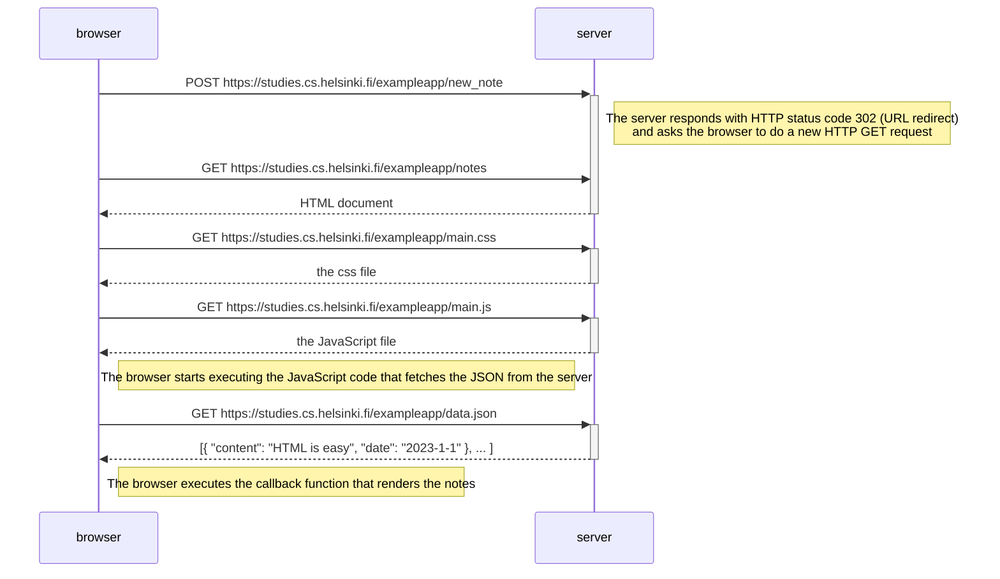

```mermaid
sequenceDiagram
    participant browser
    participant server
    
    browser->>+server: POST https://studies.cs.helsinki.fi/exampleapp/new_note
    
    Note right of server: The server responds with HTTP status code 302 (URL redirect) <br /> and asks the browser to do a new HTTP GET request

    browser->>server: GET https://studies.cs.helsinki.fi/exampleapp/notes
    server-->>-browser: HTML document

    browser->>+server: GET https://studies.cs.helsinki.fi/exampleapp/main.css
    server-->>-browser: the css file

    browser->>+server: GET https://studies.cs.helsinki.fi/exampleapp/main.js
    server-->>-browser: the JavaScript file

    Note right of browser: The browser starts executing the JavaScript code that fetches the JSON from the server

    browser->>+server: GET https://studies.cs.helsinki.fi/exampleapp/data.json
    server-->>-browser: [{ "content": "HTML is easy", "date": "2023-1-1" }, ... ]

    Note right of browser: The browser executes the callback function that renders the notes

```
